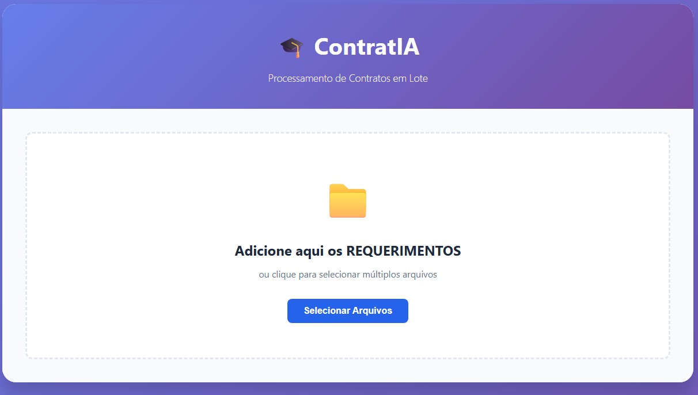

<div align="center">

# ContratIA

**Automação inteligente de contratos escolares com OCR e processamento em lote**

[](https://python.org)
[](https://flask.palletsprojects.com)
[](https://pymupdf.readthedocs.io)
[](https://github.com/tesseract-ocr/tesseract)
[](LICENSE)

O que antes levava **mais de 5 minutos por família**, agora leva **menos de 30 segundos.**

</div>

---

## Sobre o Projeto

O **ContratIA** nasceu de uma necessidade real: reduzir o tempo gasto pelo setor administrativo do Colégio Anchieta na geração manual de contratos de matrícula. A cada período de matrículas, dezenas de arquivos precisavam ser combinados individualmente — um processo repetitivo, lento e sujeito a erros.

A solução foi criar uma aplicação web local que automatiza todo esse fluxo: o usuário faz o upload dos requerimentos em PDF, o sistema detecta automaticamente o nome do aluno e o segmento escolar via OCR, e gera os contratos finais prontos para entrega — tudo em lote, com revisão antes do processamento.

---

## Funcionalidades

- **Upload em lote** — arraste e solte múltiplos PDFs de uma vez
- **Extração automática de nomes** — lê o nome do aluno diretamente do PDF do requerimento
- **Detecção de segmento via OCR** — identifica automaticamente se o contrato é de Educação Infantil/Fundamental ou Ensino Médio
- **Revisão antes de processar** — edite nomes e ajuste o tipo de contrato individualmente antes de confirmar
- **Agrupamento de irmãos** — combina múltiplos alunos da mesma família em um único contrato
- **Relatório de resultados** — exibe sucesso e erros após o processamento com download individual de cada arquivo
- **Interface 100% local** — nenhum dado sai da máquina, sem dependência de internet

---

## Screenshots

### Tela Inicial — Upload de Requerimentos


<!-- Próximos prints: tabela de revisão, resultados e download -->

---

## Stack

| Camada | Tecnologia |
|---|---|
| Backend | Python 3.7+ · Flask 3.0.3 |
| PDF | PyMuPDF (fitz) 1.24.14 |
| OCR | Tesseract-OCR · pytesseract 0.3.13 |
| Frontend | HTML5 · CSS3 · JavaScript (Vanilla) |

---

## Como Rodar

### Pré-requisitos

- [Python 3.7+](https://python.org/downloads)
- [Tesseract-OCR](https://github.com/UB-Mannheim/tesseract/wiki) instalado em `C:\Program Files\Tesseract-OCR\`

### Instalação

```bash
# Clone o repositório
git clone https://github.com/seu-usuario/ContratIA.git
cd ContratIA

# Instale as dependências
pip install -r requirements.txt
```

### Iniciando

**Windows (recomendado):**
```
Clique duplo em: Iniciar ContratIA.bat
```

**Ou via terminal:**
```bash
python app_v2.py
```

Acesse `http://localhost:5000` no navegador.

---

## Fluxo de Uso

```
1. Arraste os PDFs de requerimento para a área de upload
       ↓
2. O sistema extrai nome e detecta o segmento automaticamente
       ↓
3. Revise os dados na tabela — edite o que precisar
       ↓
4. Clique em "Processar Todos"
       ↓
5. Baixe os contratos prontos individualmente
```

---

## Estrutura do Projeto

```
ContratIA/
├── app_v2.py                  # Backend Flask (API + lógica de processamento)
├── requirements.txt           # Dependências Python
├── Iniciar ContratIA.bat      # Script de inicialização (Windows)
│
├── templates/
│   └── index_v2.html          # Interface web
│
├── static/
│   └── style_v2.css           # Estilos
│
├── contratos_base/            # Templates de contrato (não versionados)
│   ├── Contrato_EI_EF1.pdf
│   └── Contrato_EF2_EM.pdf
│
├── contratos_prontos/         # Contratos gerados (não versionados)
├── uploads/                   # Upload temporário (não versionado)
└── tessdata/
    └── por.traineddata        # Dados OCR — Português
```

---

## Desempenho

| Métrica | Resultado |
|---|---|
| Tempo por aluno | ~1–2 segundos |
| Capacidade | 30–40 alunos/minuto |
| Redução de tempo | ~90% vs. processo manual |

---

<div align="center">

Desenvolvido para uso interno · Colégio Anchieta

</div>
